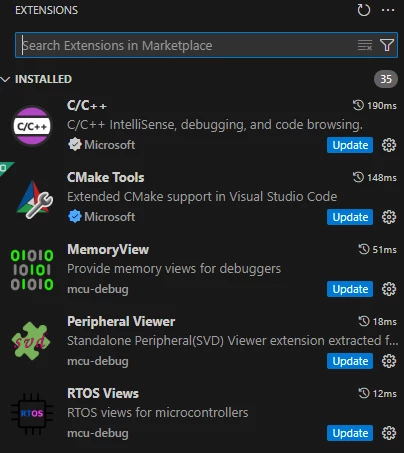
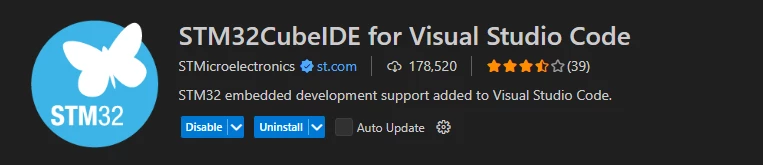
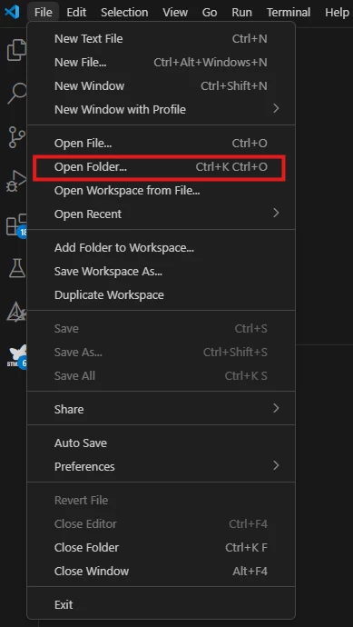
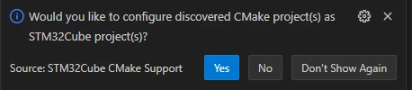
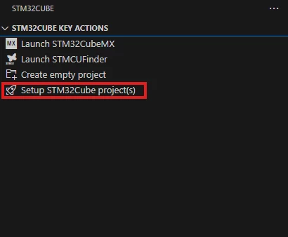
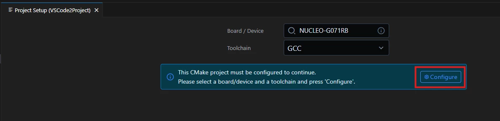
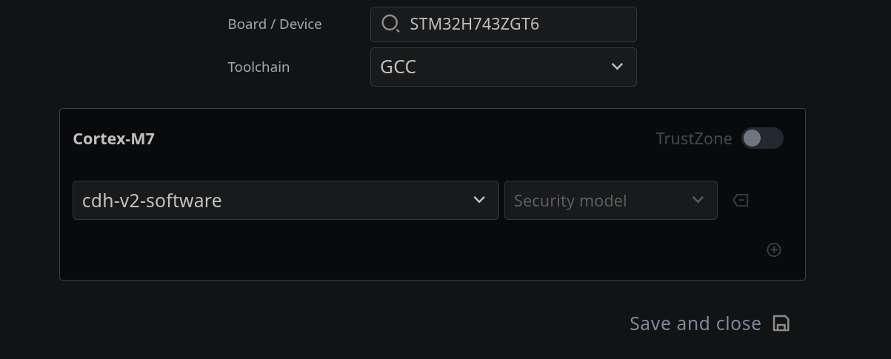
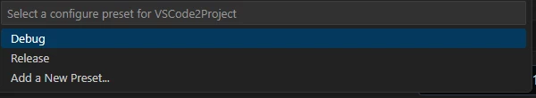
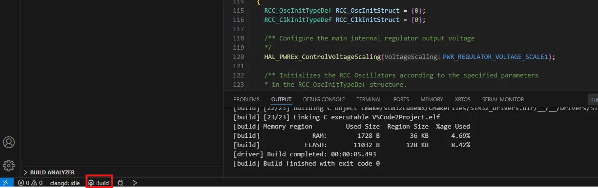

### cdh-v2-software

This project is generated through STM32CubeMX, all user code is contained in CDH folder.

This repository contains code for the C&DH PCB version 2, which is a modular design with an STM32H743ZGT6 and 32MB of SDRAM.

## Dependenies

You must install the following tools to use this project:

- STM32Cube MX
- STM32CubeIDE VSCode extension
- CMake Tools VSCode extension
- Dependencies requiered by STM32Cube, see st.com website

## Setting up the STM32 VS Code extension

Download the STM32 VS Code extension. This is done through the VS Code application with your PC connected to the internet.

1. In the VS Code application, open [Extensions] (Ctrl + Shift + X) and search for STM32CubeIDE for Visual Studio Code

2. Install the [STM32 VS Code Extension]. It looks like this picture below.

## building

1. In VS Code, select File > Open Folder, and navigate to the project folder.

2. At the bottom right of your screen a popup appears, asking if you would like to configure the discovered CMake Project as a STM32Cube Project. Select [Yes].

Alternatively, you can select [Setup STM32Cube project(s)] under STM32Cube Key Actions.

3. The "Project Setup" tab opens, allowing you to configure your CMake project as a STM32Cube project. Under Board/Device, you can enter the part number that you are working with. For this project, you can enter STM32H743ZGT6.

Once you select [Configure], the screen should look as below.

4. Next, you should see a pop-up for selecting a launch configuration. Here, select [Debug].

5. Build the project by selecting the [Build] option in the bottom left of the screen.

